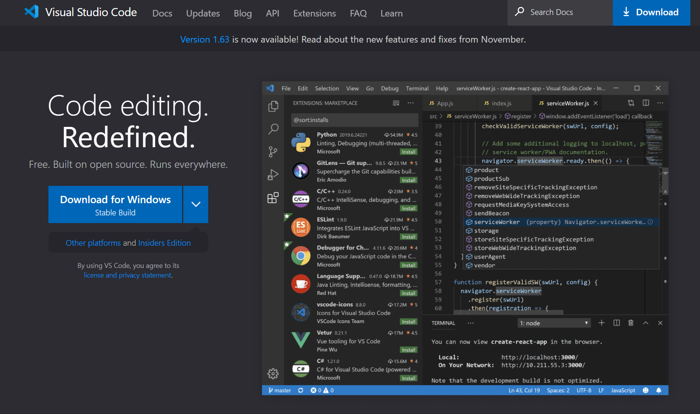
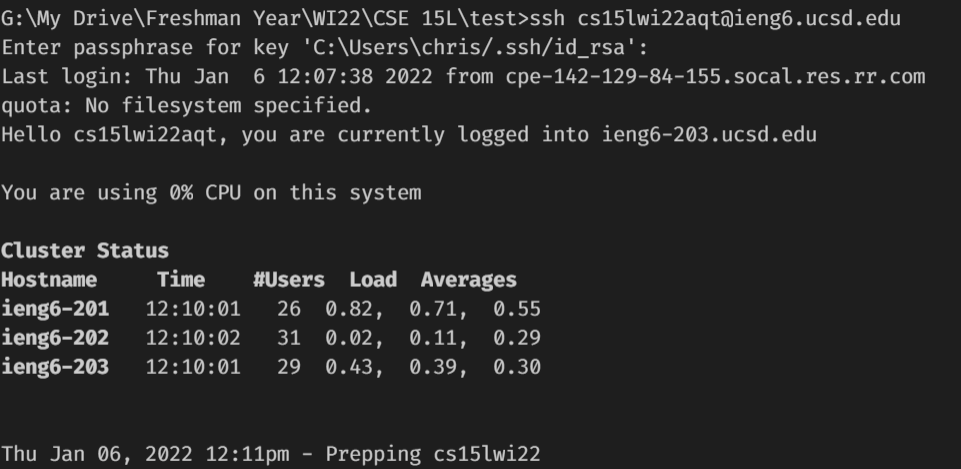
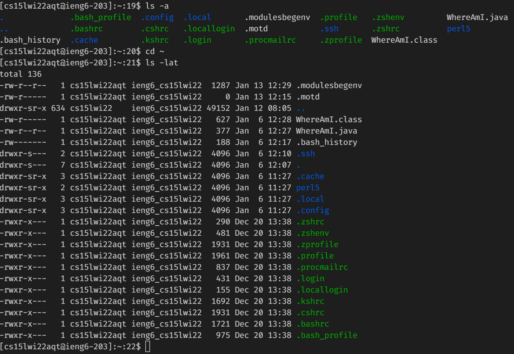
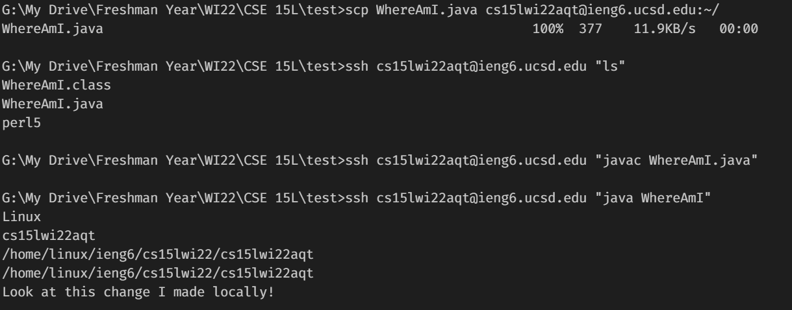
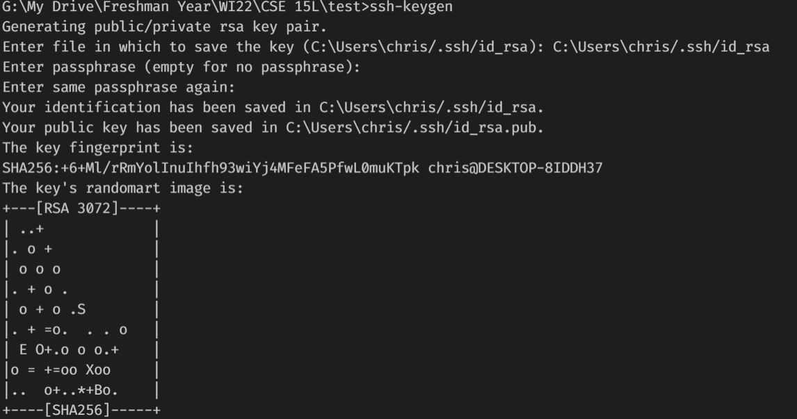
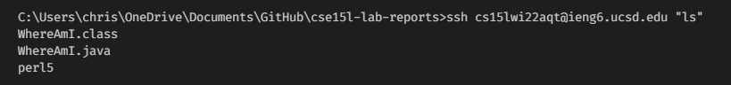

# Lab Report 1

So, I hear you want to learn how to log into a course-specific account on ieng6. Well, you came to the right place.

## Installing VS Code
The first thing you are going to want to do is head to the link [code.visualstudio.com](https://code.visualstudio.com/). Once you are there, you should see this screen: 

From here, you want to click on either of the download buttons and an installer will be downloaded. Follow the instructions on the installer and then you'll have installed VS Code!

## Remotely Connecting
To remotely connect to a course specific account on an ieng6 computer, you are going to want to open a terminal in VS Code. Once you are there, you are going to want to type:
```
ssh your-course-specific-account@ieng6.ucsd.edu
```
An example of this can be seen here:

If it is your first time connecting to the server, it will ask you if you want to continue connecting. Simply type `yes` and press enter. You will then have to enter in your password to finish connecting.

## Trying Some Commands
Now, we are going to try some commands on the ieng6 computer. Some good commands to run are:
* `ls -a`
* `cd ~`
* `ls -lat`

Here is what happens when we run these commands:

As can be seen, both `ls` commands show a list of the files in the directory in different ways. While `cd ~` is not doing anything in this example, that command will return the user to the home directory.

## Moving Files with `scp`

Next, we are going to be moving files from the client to the server. To do this, we must first exit the remote connection either by pressing `ctrl-d` or using the command `exit`. We will then choose a java file that can compile and use the command 
```
scp fileName.java your-course-specific-account@ieng6.ucsd:~/
```

We then want to remotely connect to the server again using the previous steps. Once we are there, use the command `ls` and you will be able to see the file there. Then, we can compile and run the program by using the commands `javac fileName.java` and java `fileName`. An example of this can be seen here:


## Setting an SSH Key

As you have probably realized by now, typing in your password every time you want to remotely connect is a pain. We will now be setting up an ssh key so you will not have to enter a password to connect anymore.

To start this, you will first make sure you have exited from the server. Then, you will use the command `ssh-keygen`. It will first ask you which file you would like to save the key in. You will want to copy the directory at the end of the question (before the colon), and copy that to the line and press enter. It will then ask you for a passphrase. Simply press enter and when it asks you to re-enter the passphrase, just hit enter again. This process can be seen here:

Now that you have the key generated, you will need to ssh back into the server and use the command `mkdir .ssh`
Exit the server and use the command with your own path from the keygen step and course specific account.
```
scp /Users/chris/.ssh/id_rsa.pub cs15lwi22@ieng6.ucsd.edu:~/.ssh/authorized_keys
```
After this step is complete, you will now be able to ssh into the server without entering your password! Doing this saves you as many keystrokes as your password takes to type in every time you need to remotely connect. 

## Optimizing Remote Running

To finish this lab report off, we will now discuss some helpful tips for using the command line for editing and running files.

* One helpful tip is that you can run commands on the server without fully logging in by adding a command in quotes at the end of an ssh command:

In this example, we use 37 keystrokes. We save keystrokes in two main ways here. The first is that we save keystrokes by not having to enter in a password because of the previous step. The second is that we do not have to enter the command on the next line and press enter again and then exit either by typing exit or pressing `ctrl-d`.
* Another helpful tip is that you can use semicolons to run multiple commands on the same line:
```
$ cp WhereAmI.java OtherMain.java; javac OtherMain.java; java WhereAmI
```
This command would copy the WhereAmI.java to a new file OtherMain.java, compile that new file, and then run WhereAmI. Doing this does not really save keystrokes as the keystrokes that would be used pressing enter are instead used to type in the semicolons. 

Hopefully, you are now able to efficiently connect to and use a computer in ieng6 remotely!