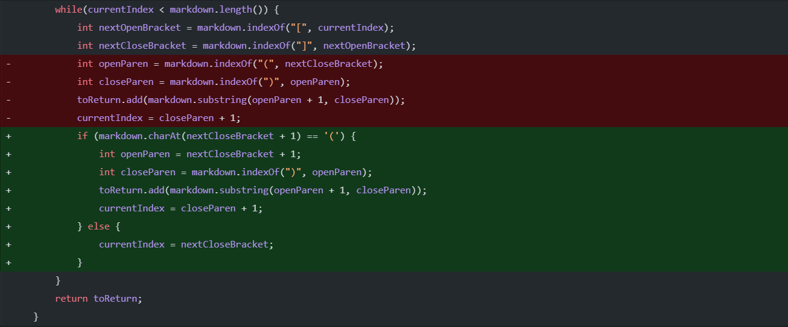
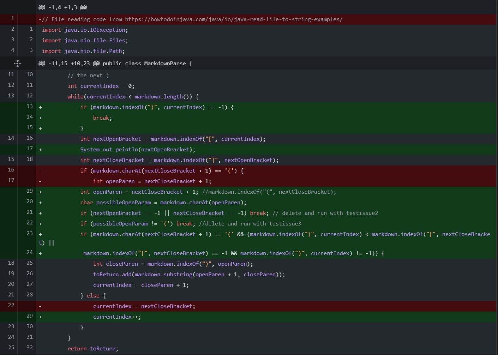
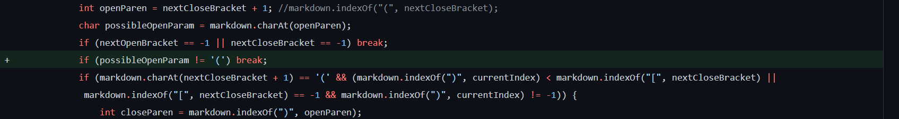

# Lab Report 2

Well, I guess you must have been quite enthralled by my last lab report because here we are again. Let's get right into the material.

## First Code Change

The first code change we made was making it only print out the value inside of the parenthesis if it came right after the close bracket.

This fixed a test case like this:
[Test case](test-file-3.html)

Before in this test case, it would still print the url.com as a link despite it not being a link in markdown because of the text in between it. The output of running the file in the command line would be `[url.com]` instead of just `[]`.

The relationship between the bug and the symptom was that the bug would cause the program to register url.com as a link and therefore cause the program to print it as a link, which was the symptom. The failure-inducing input that caused this was the text between the close bracket and the open parenthesis in the markdown file.

## Second Code Change

The second change we made was adding more statements to the if statement to check whether or not the input should be considered.

This fixed a test case like this: 
[Test case](test-file-2.html)

In this test case, it would see the second link as invalid and exit the program, therefore not finding the valid link in the following line. This statement fixed this as it was making sure that when it detected an open parenthesis after a closed bracket, it was checking to see if there was a closed parenthesis after it before another open bracket came about.

The bug here was caused by an invalid link being the failure-inducing input, causing the program to not detect the valid link at the end. The symptom could be seen by the output only outputting `[something.com]` in the terminal instead of the correct input of `[something.com, url.com]`.

## Third Code Change

The third change we made was adding a break if the character directly after the close bracket was not an open parenthesis and made sure that there was an open bracket and closed bracket.

This fixed a test case like this:
[Test case](test-file3.html)

A problem arose in this test case where it would detect the brackets but since there was no parenthesis anywhere following it, it would go into an infinite loop. This fixed it by breaking it out of the loop when it detected that there was no parenthesis following the closed bracket.

The bug here of an infinite loop was caused by the failure inducing input of a pair of brackets with no parenthesis anywhere in the program following them. The symptom of this was the program being stuck in an infinite loop and not displaying any results. The correct output of the program was `[]`, but this could not be seen as it would not display anything due to the infinite loop.