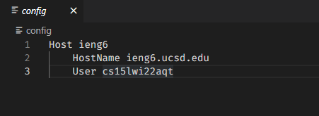
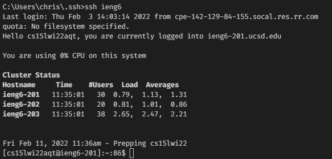
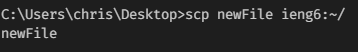

# Lab Report 3

## Streamlining ssh Configuration

### Creating and setting up config

To begin the process of streamlining your ssh configuration, you are going to want to start by navigating to the .ssh folder that contains your ssh key. 

In this folder, you are going to want to make a new file named `config`. You can easily do this in two main ways: 

- Open the directory in vs code and make a new file named config
- cd into the directory in the command line and use `nul > config`

Then, open the file in a text editor (I used VScode). You then want to add this text into the file(replacing the details with your own):
```
Host ieng6
	HostName ieng6.ucsd.edu
	User cs15lwi22zzz
```

My file looks like this:



### Using ssh to log in

After setting up config, all you need to do to ssh in to the server is type `ssh ieng6`, with ieng6 being whatever string follows the word Host in the config file.

An example of this can be seen here:



### Using this alias to scp

Now that we have this set up, we can also use this alias to scp files to the remote server. 

All we have to do for this is type `scp fileName ieng6:~/` with ieng6 being whatever you put as the alias and fileName being the name of the file.

An example of this can be seen here:



Through setting up this alias, the process of remotely connecting through ssh is made much easier.