# Lab Report 4

## My Markdown Parse

My repository can be found
[here](https://github.com/christopherthomason/markdown-parse)
. 

## The Group I Reviewed's Markdown Parse

The group I reviewed's repository can be found
[here](https://github.com/YueSteveYin/MarkDownParseGroup)
.

## Expected Output of Given Snippets

### Expected output of first snippet

For my first test on both repositories, I used the first given snippet which is expected to produce this:

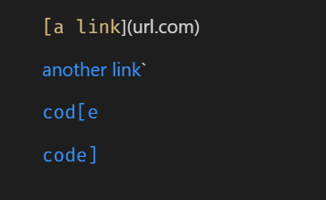

As can be seen from this image, 3 links are expected, those being another link', cod[e, and code]. These links connect to `google.com, google.com, and ucsd.edu respectively. 

### Expected output of second snippet

For my second test on both repositories, I used the second given snippet which is expected to produce this:

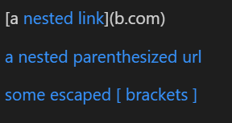

As can be seen once again, 3 links are expected. This time, the expected links are nested link, a nested parenthesized url, and some escaped [ brackets ]. These links connect to a.com, a.com(()), and example.com respectively.

### Expected output of third snippet
For my third test on both repositories, I used the third given snippet which is expected to produce this:

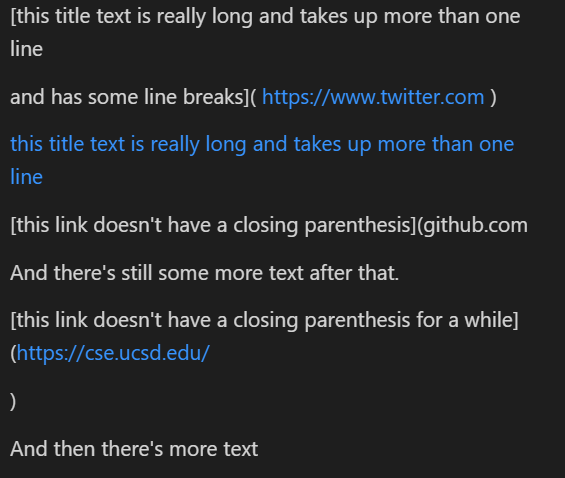

The image shows that the links produced by the third snippet should be https:/​/www.twitter.com, this title text is really long and takes up more than one line, and https​://cse.ucsd.edu/. These links lead to https:/​/www.twitter.com, https:/​/ucsd-cse15l-w22.github.io/, and https​://cse.ucsd.edu/ respectively.

## Test 1

My code for the first test is shown here:

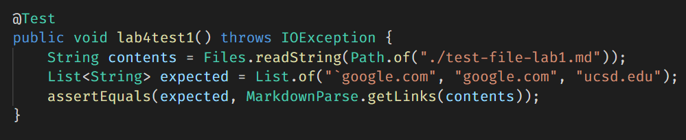

### My Implementation

This test did not pass with my implementation of the code. When running the test, it produced this output:

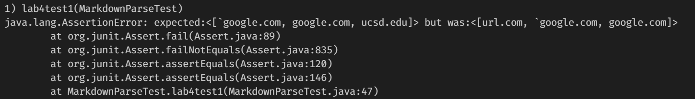

### Other Group's Implementation

This test did not pass with the other group's implementation of the code. When running the test, it produced this output:

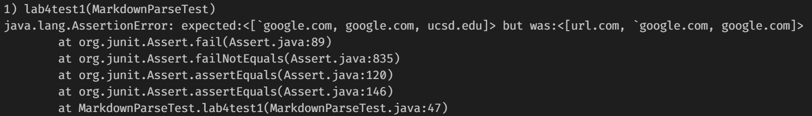

## Test 2

My code for the second test is shown here:

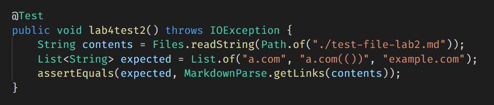

### My Implementation

This test did not pass with my implementation of the code. When running the test, it produced this output:

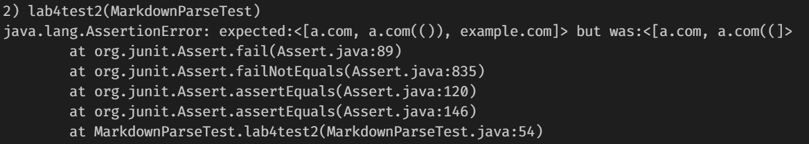

### Other Group's Implementation

This test did not pass with the other group's implementation of the code. When running the test, it produced this output:

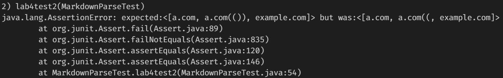

## Test 3

My code for the third test is shown here:

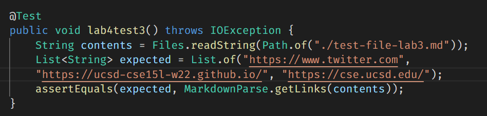

### My Implementation

This test did not pass with my implementation of the code. When running the test it produced this output:

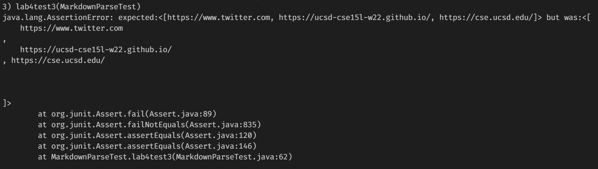

### Other Group's Implementation

This test did not pass with the other group's implementation of the code. When running the test, it produced this output:

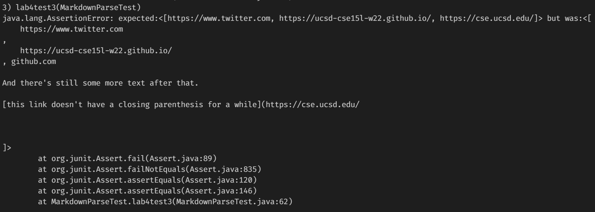

## Question Answers

### Question 1

I think there is a small code change that would make my program work for snippet 1 and all related cases that use inline code with backticks. I think if the code checked for a set of backticks around the brackets, it would be able to detect that it is an invalid link if it finds a pair. It would be tricky to make sure that it does not determine that it is invalid if the backticks were both in the link title, but it would be doable in less than 10 lines of code.

### Question 2

I do not think that there could be a small code change that would make my program work for snippet 2 and all related cases that have nested parentheses, brackets, and escape brackets. I think this because to do this, a stack would most likely have to be implemented into the code so that it would only read in the link between the correct starting and closing bracket. To do this correctly, I think it would take quite a few more lines than 10. 

### Question 3

I think that there is a small code change that would make my program work for snippet 3 and all related cases that have newlines in brackets and parenthesis. To do this, I would have a link that is about to be added to the list of links be checked for newlines and if they are found, have them removed from the string. It would only require a few lines of code to implement this if statement and the removal of the newline. 