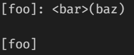
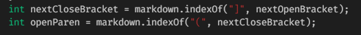
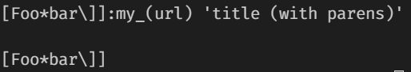
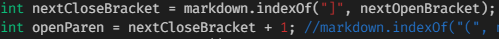
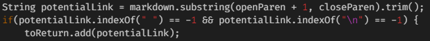

# Lab Report 5

## Two Commonmark-Spec Tests

### How The Tests Were Found

To find the tests with different results, I wrote the results from running a for loop in bash on each file in test-files to a text file called results.txt. I did this for each implementation, and then used vimdiff on both text files to see the differences and picked two that looked like substantial differences.

### First Test

The first file that had a different result with my implementation than the provided implementation was 201.md, which looked like this:

In my implementation of the code, the output produced by this file was `[]`, while in the given implementation, the output produced by this file was `[baz]`. My implementation is correct in this instance, while the given implementation was incorrect, as the correct output should be `[]`. This is because this markdown file does not contain a link, as the one that was considered one by the given implementation is invalid.

The bug in the code is that it does not care if there are spaces and characters between the close bracket and the parenthesis. Code that would need to be fixed: 

The other implementation would have to make it so that it detects if there is a space in between the close bracket and the open parenthesis and determine that the link is invalid if that is the case.

### Second Test

The second file that had a different result with my implementation than the provided implementation was 194.md, which looked like this:

In my implementation of the code, the output produced by this file was `[]`. In the given implementation, the output produced by this file was `[url]`. In this instance, neither implementation is correct, as the correct output should be `[my_(url)]`. The markdown file recognizes all of that text, including the part outside of the parenthesis and the parenthesis themselves as part of the link to the file.

The bug for my implementation is that it does not recognize a link when there is an extra close bracket and no parenthesis. The bug for the other implementation is that it does not recognize the part outside of the parenthesis as part of the link.

My code that would need to be fixed:

I would need to make it so it does not just find the next close bracket and only look for a parenthesis immediately following the first close bracket found.

Other implementation's code that would need to be fixed:

The other implementation would need to make it so the text following the close bracket would be detected while still making sure it is a valid link.